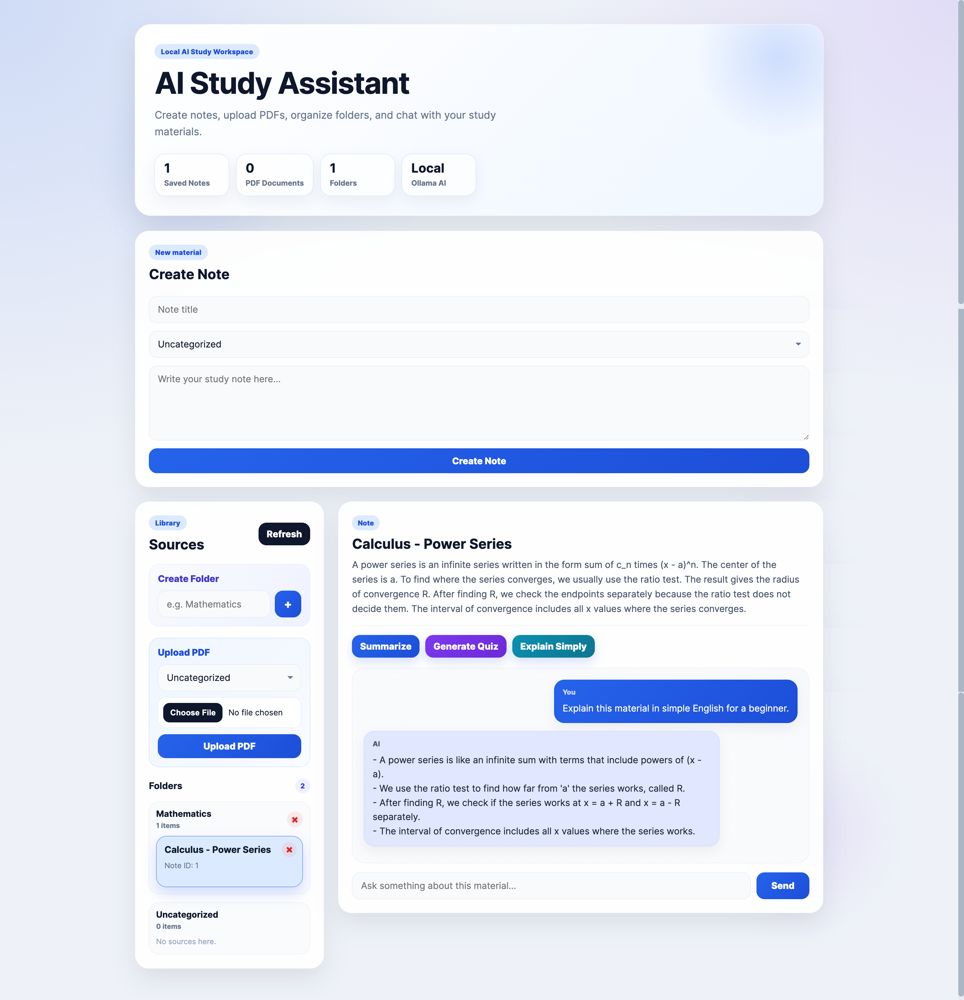

# AI Study Assistant Frontend

AI Study Assistant Frontend is a React + Vite web interface for the AI Study Assistant project.

It connects to a FastAPI backend and allows users to create study notes, upload PDF study materials, organize sources into folders, and chat with selected materials using a local AI model through Ollama.

## Preview



## Features

- Create study notes
- Upload PDF study materials
- Organize notes and PDFs into folders
- Move notes and PDFs between folders using drag and drop
- Keep uncategorized sources outside folders
- Delete notes, PDF documents, and folders
- Select a note or PDF as the active study source
- Chat with selected notes using saved note content as context
- Chat with selected PDF documents using extracted PDF text as context
- Quick action buttons:
  - Summarize
  - Generate Quiz
  - Explain Simply
- Clean chat-style interface
- Responsive layout
- Polished UI animations and hover effects

## Tech Stack

- React
- Vite
- JavaScript
- CSS
- Fetch API

## Backend Repository

This frontend requires the FastAPI backend server to be running locally.

Backend repository:

```text
https://github.com/Ahmet-Tarik/ai-study-assistant-backend
```

Default backend URL:

```text
http://127.0.0.1:8000
```

## How to Run

Clone the repository:

```bash
git clone https://github.com/Ahmet-Tarik/ai-study-assistant-frontend.git
cd ai-study-assistant-frontend
```

Install dependencies:

```bash
npm install
```

Start the development server:

```bash
npm run dev
```

Open the app in the browser:

```text
http://localhost:5173
```

## Required Backend Setup

Before using the frontend, start the backend server:

```bash
cd ../ai-study-assistant-backend
source .venv/bin/activate
uvicorn main:app --reload
```

The backend must be running at:

```text
http://127.0.0.1:8000
```

Ollama should also be running locally with the model configured in the backend.

## Main UI Flow

1. Create a folder such as `Mathematics` or `Formal Languages`.
2. Create a study note or upload a PDF.
3. Assign the note or PDF to a folder.
4. Select a source from the sidebar.
5. Chat with the selected material.
6. Use quick actions to summarize, generate quiz questions, or explain the material simply.
7. Drag and drop sources between folders when needed.

## Connected Backend Endpoints

The frontend currently uses these backend endpoints:

```text
GET    /folders
POST   /folders
DELETE /folders/{folder_id}

GET    /notes
POST   /notes
PUT    /notes/{note_id}
DELETE /notes/{note_id}
POST   /notes/{note_id}/chat

GET    /documents
POST   /documents/upload-pdf
PUT    /documents/{document_id}/folder
DELETE /documents/{document_id}
POST   /documents/{document_id}/chat
```

## Project Status

Current version includes:

- Chat-based frontend layout
- Folder organization
- Drag-and-drop source movement
- Notes integration
- PDF upload integration
- PDF document integration
- Contextual AI chat with notes
- Contextual AI chat with PDF documents
- Quick action buttons
- Delete actions for notes, PDFs, and folders
- UI polish with animations and hover effects

Planned next steps:

- Save chat history to the backend
- Add authentication
- Add user accounts
- Add deployment configuration
- Improve mobile experience further

## Author

Ahmet Tarık Sevinç